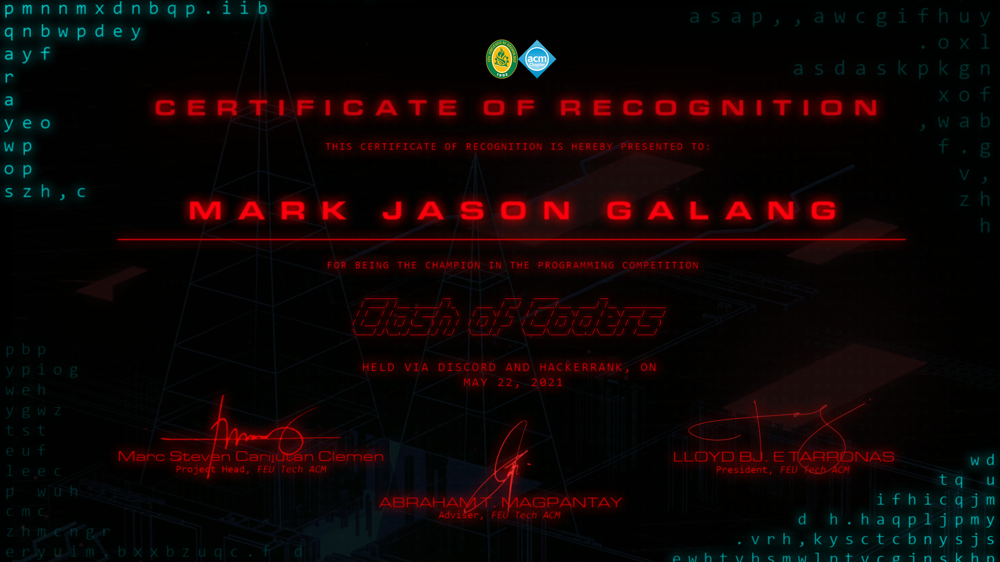

# FEU-Tech-Clash-of-Coders-Contest
## Certificate

## Final Result
### Total Points: 139.00
### Rank: 1st
### Award: Champion
### Date: May 22, 2021
### Prize: PHP 1500.00
## Contest Link (Hackerrank)
Link: https://www.hackerrank.com/contests/fitacm-clash-02ac4a5e-ba92-11eb-8529-0242ac130003/challenges
## Problem 1 - Easy (Two Pairs - Fully Solved: 10 Points out of 10 Points)
Link: https://www.hackerrank.com/contests/fitacm-clash-02ac4a5e-ba92-11eb-8529-0242ac130003/challenges/fitacm-two-pairs
## Problem 2 - Easy (Placing the Values - Did Not Attempt)
Link: https://www.hackerrank.com/contests/fitacm-clash-02ac4a5e-ba92-11eb-8529-0242ac130003/challenges/fitacm-placing-the-values
## Problem 3 - Easy (Palindromic Pass - Fully Solved: 10 Points out of 10 Points)
Link: https://www.hackerrank.com/contests/fitacm-clash-02ac4a5e-ba92-11eb-8529-0242ac130003/challenges/fitacm-palindrome-detection
## Problem 4 - Easy (Piglatin Translator - Partially Solved: 9 Points out of 10 Points)
Link: https://www.hackerrank.com/contests/fitacm-clash-02ac4a5e-ba92-11eb-8529-0242ac130003/challenges/fitacm-piglatin
## Problem 5 - Easy (Fizz Buzz 2.0r1 - Fully Solved: 10 Points out of 10 Points)
Link: https://www.hackerrank.com/contests/fitacm-clash-02ac4a5e-ba92-11eb-8529-0242ac130003/challenges/fitacm-cust-fizz-buzz
## Problem 6 - Medium (Password Permutations - Fully Solved: 20 Points out of 20 Points)
Link: https://www.hackerrank.com/contests/fitacm-clash-02ac4a5e-ba92-11eb-8529-0242ac130003/challenges/fitacm-password-permutations
## Problem 7 - Medium (Shortest Segments - Fully Solved: 20 Points out of 20 Points)
Link: https://www.hackerrank.com/contests/fitacm-clash-02ac4a5e-ba92-11eb-8529-0242ac130003/challenges/fitacm-shortest-segments
## Problem 8 - Medium (User Scavenger Hunt - Fully Solved: 20 Points out of 20 Points)
Link: https://www.hackerrank.com/contests/fitacm-clash-02ac4a5e-ba92-11eb-8529-0242ac130003/challenges/fitacm-user-scavenger-hunt
## Problem 9 - Medium (Change Counter - Fully Solved: 20 Points out of 20 Points)
Link: https://www.hackerrank.com/contests/fitacm-clash-02ac4a5e-ba92-11eb-8529-0242ac130003/challenges/fitacm-change-counter
## Problem 10 - Medium (What are the chances? - Fully Solved: 20 Points out of 20 Points)
Link: https://www.hackerrank.com/contests/fitacm-clash-02ac4a5e-ba92-11eb-8529-0242ac130003/challenges/fitacm-what-are-the-chances
## Problem 11 - Hard (Transport Tracer - Did Not Attempt)
Link: https://www.hackerrank.com/contests/fitacm-clash-02ac4a5e-ba92-11eb-8529-0242ac130003/challenges/fitacm-transporter
## Problem 12 - Hard (Fan's Choice Award - Did Not Attempt)
Link: https://www.hackerrank.com/contests/fitacm-clash-02ac4a5e-ba92-11eb-8529-0242ac130003/challenges/fitacm-fans-choice-award
